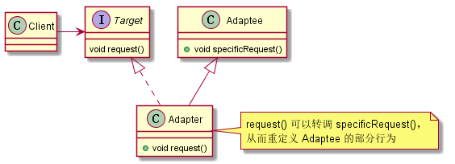
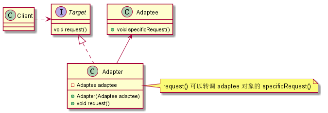
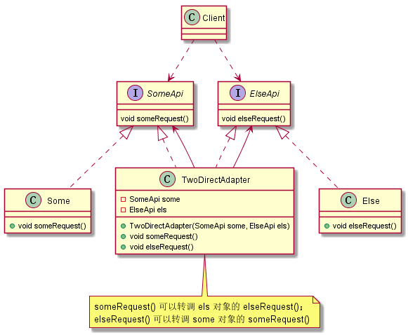
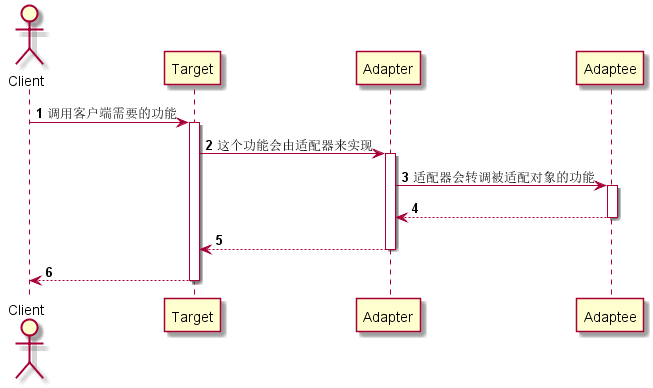

# Adapter（适配器）——类对象结构型模式

## 意图

将一个类的接口转换成客户期望的另一个接口。适配器模式让原本接口不兼容的类可以一起工作。

## 别名

包装器（Wrapper）

## 动机

生活中有大量类似的例子，比如：

*   各种管道的转接头、不同制式的插座等。

*   使用转接线将电源的接口适配成为硬盘所需的接口，这个转接线就类似适配器。

## 适用性

*   你想使用一个已经存在的类，而它的接口不符合你的要求。

*   你想创建一个可以复用的类，该类可以和其它不相关的类或不可预见的类（即那些接口可能不一定兼容的类）协同工作。

*   你想使用一些已经存在的子类，但是不可能对每一个子类都进行适配，这种情况可以选用对象适配器，直接适配它们的父类就可以了。

## 结构

类适配器使用多重继承来进行适配。由于 Java 不支持多重继承，所以 Java 不能实现标准的类适配器。在 Java 中，通过使 `Adapter` 实现 `Target` 接口，然后继承 `Adaptee`，可以变相地创建类适配器。



对象适配器依赖于对象组合来进行适配，如下图所示：



适配器也可以实现双向的适配，称为双向适配器。适配器通常都是把 `Adaptee` 适配成为 `Target`，其实也可以把 `Target` 适配成为 `Adaptee`；也就是说双向适配器可以同时作为 `Target` 和 `Adaptee` 来使用。

类似的，可以使用多重继承来实现双向适配器。由于 Java 不支持多重继承，所以可以使双向适配器同时实现 `Target` 和 `Adaptee` 的接口。



## 参与者

*   `Target`（目标对象）

	——定义 `Client` 使用的与特定领域相关的接口。

*   `Client`（客户端）

	——与符合 `Target` 接口的对象协同。

*   `Adaptee`（被适配者）

	——需要被适配的接口。

*   `Adapter`（适配器）

	——将 `Adaptee` 适配成为 `Target`。

## 协作

`Client` 在 `Adapter` 实例上调用一些操作，然后适配器调用 `Adaptee` 的操作实现这个请求。



## 效果

类适配器与对象适配器有不同的权衡。

类适配器的特点是：

*   `Adapter` 直接继承了 `Adaptee`，结果是当我们想要匹配 `Adaptee` 以及所有它的子类时，`Adapter` 将不能胜任。

*   使得 `Adapter` 可以重定义 `Adaptee` 的部分行为，因为 `Adapter` 是 `Adaptee` 的一个子类。

*   仅仅引入了一个子类，并不需要额外的指针以间接获得 `Adaptee`。

对象适配器的特点是：

*   允许一个 `Adapter` 与多个 `Adaptee`——即 `Adaptee` 本身以及它的所有子类——一起工作。`Adapter` 也可以同时给所有的 `Adaptee` 添加功能。

*   使得重定义 `Adaptee` 的行为比较困难。这就需要生成 `Adaptee` 的子类并且使得 `Adapter` 引用这个子类而不是引用 `Adaptee` 本身。

适配器不是对所有的客户都透明。被适配的对象不再兼容 `Adaptee` 接口。双向适配器提供了这样的透明性。在两个不同的客户需要用不同的方式查看同一个对象时，双向适配器尤其有用。

## 实现

## 代码示例

Java 采用迭代器后，原有的 `Enumeration` 已经不推荐使用。但是，还是有相当多的遗留代码依赖于 `Enumeration`。我们可以使用适配器来对 `Enumeration` 和 `Iterator` 进行适配。

```java
/**
 * 对象适配器，它将<code>Iteratorc适配为<code>Enumeration</code>，
 * 以便返回<code>Enumeration</code>的现有 API 可以轻松地在新集合之上运行。
 * 
 * @author tequlia2pop
 */
public final class Enumerator<T> implements Enumeration<T> {

	/**
	 * 该类实际操作的是一个<code>Iterator</code>，它被包装为一个<code>Enumeration</code>。
	 */
	private Iterator<T> iterator;

	/**
	 * 返回一个 Enumeration，它由指定的 Iterator 返回的值组成。
	 *
	 * @param iterator
	 */
	public Enumerator(Iterator<T> iterator) {
		this.iterator = iterator;
	}

	/**
	 * 返回一个 Enumeration，它由指定的 Collection 返回的值组成。
	 *
	 * @param collection
	 */
	public Enumerator(Collection<T> collection) {
		this(collection.iterator());
	}

	/**
	 * 返回一个 Enumeration，它由指定的 Map 返回的值组成。
	 *
	 * @param map
	 */
	public Enumerator(Map<?, T> map) {
		this(map.values().iterator());
	}

	@Override
	public boolean hasMoreElements() {
		return iterator.hasNext();
	}

	@Override
	public T nextElement() throws NoSuchElementException {
		return iterator.next();
	}

	public static void main(String[] args) {
		List<String> list = Arrays.asList("a", "b", "c");
		for (Enumeration<String> e = new Enumerator<>(list.iterator()); e.hasMoreElements();) {
			System.out.print(e.nextElement() + " ");
		}
	}

}
```

```java
/**
 * 对象适配器，将<code>Enumeration</code>适配为 <code>Iterator</code>。
 * 虽然 Java 已经采用了迭代器，但还是有相当多的遗留代码依赖于<code>Enumeration</code>，
 * 所以可以利用适配器将<code>Enumeration</code>转换为<code>Iterator</code>。
 * 
 * @author tequlia2pop
 */
public class EnumerationIterator<T> implements Iterator<T> {

	private Enumeration<T> e;

	public EnumerationIterator(Enumeration<T> e) {
		this.e = e;
	}

	@Override
	public boolean hasNext() {
		return e.hasMoreElements();
	}

	@Override
	public T next() {
		return e.nextElement();
	}

}
```

## 已知应用

### Java IO

Java I/O 类库大量使用了适配器模式，原始的流都是适配器类。下面举几个例子：

*   `InputStreamReader` 是一个对象适配器，它继承自 `Reader` 抽象类，并且持有了一个 `InputStream` 对象。换句话说，它将一个 `InputStream` 的接口适配为 `Reader` 的接口。

	类似的，`OutputStreamWriter` 将一个 `OutputStream` 的接口适配为 `Writer` 的接口。

*   `ByteArrayInputStream` 是一个对象适配器，它继承自 `InputStream` 抽象类，并且持有了一个 `byte` 数组。换句话说，它将一个 `byte` 数组的接口适配成 `InputStream` 的接口。

	类似的，`ByteArrayOutputStream` 将一个 `byte` 数组的接口适配成 `OutputStream` 的接口。

*   `FileInputStream` 是一个对象适配器，它继承自 `InputStrem` 抽象类，并且持有一个 `FileDiscriptor` 对象。换句话说，`FileInputStream` 将一个 `FileDiscriptor` 的接口适配为 `InputStrem` 的接口。

	类似的，`FileOutputStream` 将一个 `FileDiscriptor` 的接口适配为 `OutputStream` 的接口。
	
*   `StringReader` 是一个对象适配器，它继承自 `Reader` 抽象类，并且持有一个 `String` 对象。换句话说，`StringReader` 将 `String` 的接口适配为 `Reader` 的接口。

### Java Swing

`JTable` 类几乎处理显示表格所需的各项工作，但是它无法提前得知用户将要提供的数据。所以 `JTable` 类要求用户采用适配器模式来提供自己需要的表格数据。所以，我们必须创建一个类通过实现 `TableModel` 接口来提供要在表格中显示的数据。在实践中，我们通常通过继承 `AbstractTableModel` 来提供适配器， `AbstractTableModel` 实现了 `TableModel` 的大多数方法。

## 相关模式

*   Bridge  模式
	
	Bridge 的结构与对象适配器类似，但是 Bridge 模式的出发点不同：Bridge 目的是将接口部分和实现部分分离，从而对它们可以较为容易也相对独立的加以改变。而 Adapter 则意味着改变一个已有对象的接口。

*   Decorator  
	两种模式在实现上都是使用对象组合，可以在转调组合对象的功能前后进行一些附加的处理。但是两者的目的是完全不同的。Decorator 模式增强了其他对象的功能而同时又不改变它的接口；而 Adapter 模式将接口转换为客户期望的另一个接口。因此 decorator 对应用程序的透明性比适配器要好。结果是 decorator 支持递归组合，而纯粹使用适配器是不可能实现这一点的。

*   Proxy  模式

	Proxy 在不改变它的接口的条件下，为另一个对象定义了一个代理。